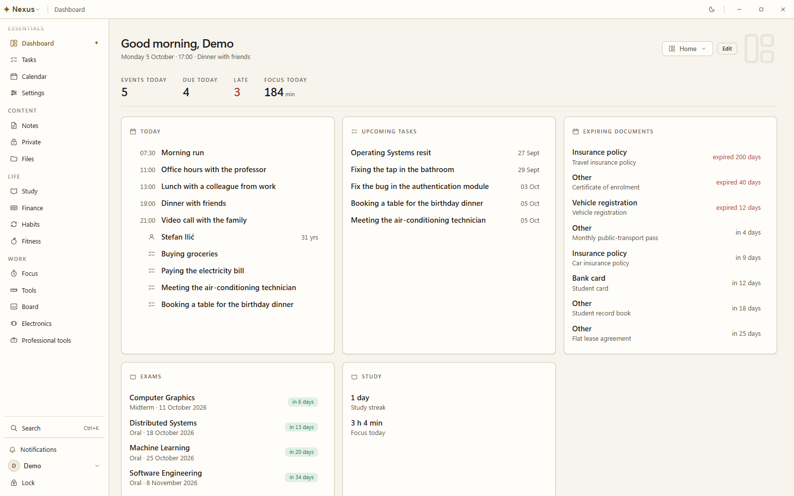

# Nexus

Nexus is a desktop application that keeps your tasks, calendar, notes, documents, study, habits, fitness, finance, a canvas and an electronics workbench in one workspace on your own computer. Everything is stored in a single encrypted SQLite database, the application works with the network off, and the interface ships in **Serbian and English** — on first run it follows the system language (Serbian when the system locale is `sr*`, English otherwise) and remembers the choice.

<picture>
  <source media="(prefers-color-scheme: dark)" srcset="docs/images/dashboard-dark.png">
  
</picture>

## Download

[**Releases**](https://github.com/lukastojiljkovic/Nexus/releases/latest) — the latest release is **1.5.0**:

| File | Platform |
| --- | --- |
| `Nexus-Setup-1.5.0.exe` | Windows 10 or 11, x64 — per-user NSIS installer |
| `Nexus-1.5.0-x86_64.AppImage` | Linux x64 with glibc — mark it executable and run it |
| `nexus-1.5.0-linux-x64.tar.gz` | Linux x64 — the payload the Gentoo ebuild installs |

Every release also carries `SHA256SUMS.txt` with its Ed25519 signature `SHA256SUMS.txt.sig`, a CycloneDX SBOM, the rendered `THIRD-PARTY-NOTICES.md`, and build-provenance attestations. On Linux the app needs a running Secret Service keyring (gnome-keyring, KWallet, KeePassXC with Secret Service enabled); without one it refuses to create an account rather than weaken the key chain. Code signing is paused for now, so SmartScreen warns on first run; the source is all here for anyone who wants to check what the installer does, and the attestations tie each file to the commit and workflow that built it. macOS is not built: nothing here has produced or opened a macOS artefact.

## What it does

Sixteen modules, switched on per profile.

| Module | What it holds |
| --- | --- |
| Dashboard | The page you open first: today's agenda, upcoming tasks, expiring documents, exams and study time, composed from widgets you place yourself. |
| Tasks | Lists, sections, subtasks, priorities, tags, recurrence and dependencies, shown as a list, a board, a calendar or a smart list, with per-task reminders. |
| Calendar | Month, week, day and agenda views, events you drag and resize, recurrence and reminders, and the tracked documents whose expiry dates appear on it. |
| Notes | Folders, tags, backlinks, templates, version history and inline flashcards. |
| Private vault | Notes encrypted so only you can read them, with a Recovery Kit of their own. |
| Documents | Attachments with in-app preview, and content search for the formats that need no dependency. |
| Study | Exam countdowns, spaced-repetition decks with Anki import, cloze and problem cards, typeset maths, and a planner that books study time before each exam. |
| Finance | Accounts, transactions, categories, budgets and subscriptions, each currency kept separate, with CSV statement import. |
| Habits | Habits with forgiving streaks, completion history and dashboard widgets. |
| Fitness | Exercise and training tracking, personal records, body measurements, and a food catalogue that names the source of every number. |
| Focus | One Pomodoro timer, shared by the study session and the utilities drawer. |
| Tools | A drawer of calculators and converters. |
| Canvas | An infinite board with live notes, cards and connectors. |
| Electronics | A wiring bench that derives an Arduino sketch, a ROS 2 package and a URDF from a circuit, and can run the plan on your own toolchain. |
| Professional toolkits | Opt-in toolkits for a profession — law, construction, agriculture, photography, music, education and others. |
| Settings | Profiles, themes, module settings and the licence screen. |

## Privacy and security, briefly

- **Local by default.** Your data is one encrypted SQLite database on your own device. The local path cannot reach the network, and that is enforced in CI rather than promised in copy.
- **Offline is the default, and update checks are opt-in.** On first start Nexus asks whether it may use the network at all: **Offline only** makes no network call of any kind, and **Offline + update checks** contacts GitHub for one purpose — checking for and downloading a new version of Nexus itself. Your notes and data never leave the computer; in update-check mode GitHub sees your IP address, as any website does, and nothing else. Every download is verified against a key compiled into the app. Change it any time in **Settings → Privacy → Network and updates**.
- **No telemetry, no analytics, no crash reporting.**
- **Cloud is off by default**, and in the build this repository produces it cannot be turned on at all: no backend project is compiled in. Optional sync is end-to-end encrypted, and the server holds ciphertext only.

Read [PRIVACY.md](PRIVACY.md) for exactly what is stored where, and
[SECURITY.md](SECURITY.md) to report a vulnerability privately.
[TERMS.md](TERMS.md) covers the distributed binaries.

## How it was built

The repository holds the full working record, and a reader can follow it end to end:

- **Specification and PRDs** — [docs/SPECIFICATION.md](docs/SPECIFICATION.md) and [docs/prd/](docs/prd/): 37 numbered requirements documents plus a glossary; `prd/00-overview.md` is the module registry.
- **Architecture and the ADR index** — [docs/architecture/overview.md](docs/architecture/overview.md), with [one table for all 87 decisions and their status](docs/architecture/adr/README.md).
- **The engineering journal** — [docs/log/README.md](docs/log/README.md): four months of entries, kept by month, recording why each decision was made.
- **The defect ledger and the gates** — [docs/defect-classes.md](docs/defect-classes.md): 149 recurring failure shapes, and the 26 `check:` scripts that enforce the ones a static check can answer.
- **The security baseline** — [docs/security/baseline.md](docs/security/baseline.md): the binding `SEC-*` rules.
- **Threat models and signed deviations** — [docs/security/threat-models/](docs/security/threat-models/) and [docs/deviations.md](docs/deviations.md).
- **The design direction** — [docs/design/direction-brief.md](docs/design/direction-brief.md); the direction that won is now the token set in `packages/tokens`.
- **The product and the design system** — [PRODUCT.md](PRODUCT.md) is the durable product record, and [DESIGN.md](DESIGN.md) documents the visual system as implemented.
- **The prompt pipeline** — [docs/prompts/README.md](docs/prompts/README.md): the prompts that produced the PRDs, the research passes and the ADRs.
- **The map** — [docs/README.md](docs/README.md) groups all of it by what you want to do.

## Contributing

Contributions are welcome — see [CONTRIBUTING.md](CONTRIBUTING.md) for the build
commands, the rules the static gates enforce, and what has to pass before a pull
request. Participation is covered by
[CODE_OF_CONDUCT.md](CODE_OF_CONDUCT.md). Questions go to
[SUPPORT.md](SUPPORT.md).

## Licence

Apache License 2.0. See [`LICENSE`](LICENSE) and [`NOTICE`](NOTICE).

Third-party notices are generated from the shipped dependency tree, never
written by hand: they are shown inside the application under **Settings →
Licences**, attached to each release as `THIRD-PARTY-NOTICES.md`, and regenerated
with `pnpm --filter @nexus/desktop licences`.

---

# For developers

## Build from source

Requirements: **Node >= 24** and **pnpm 11.10.0** (pinned through the root
`package.json`'s `packageManager` field, so `corepack enable` is enough).

```sh
pnpm install --frozen-lockfile
pnpm build
pnpm typecheck
pnpm lint
pnpm test
```

Then run the app, or check that it starts and works end to end:

```sh
pnpm --filter @nexus/desktop dev      # electron-vite dev server
pnpm --filter @nexus/desktop smoke    # build + launch + end-to-end check → "SMOKE OK"
pnpm --filter @nexus/desktop shots    # ~2,800 screenshots + a geometric audit
```

`pnpm install` provisions the Electron binary in a postinstall step. There is
no ABI dance to perform: since 13.0.3 the native SQLite module is a Node-API
addon, and one prebuilt file serves both Node (what the tests run on) and
Electron (what the app runs on). See **The native module** below.

## Everyday commands

Run from the repo root; each fans out over the workspace through Turborepo.

```sh
pnpm typecheck      # tsc --noEmit, strict, every package
pnpm test           # Vitest — core, db, desktop, and the script suites
pnpm lint           # ESLint, every package
pnpm build          # production build — tokens, desktop, gallery
```

The component gallery is the design-system review surface, not shipped to
users:

```sh
pnpm --filter @nexus/gallery dev
```

## The native module

`better-sqlite3-multiple-ciphers` is a native module, and since **13.0.3** it is
a Node-API one: the package ships eight prebuilt binaries keyed by platform and
arch with no ABI in the key, and its loader picks one at runtime. The same file
serves Node (what Vitest runs on) and Electron (what the app runs on), so there
is nothing to flip, nothing to restore, and `smoke`, `shots` and `demo` can run
while the tests do.

Nothing in this repo compiles it. `pnpm-workspace.yaml` denies the package a
build script for that reason — the `binding.gyp` it still ships would otherwise
make pnpm run `node-gyp rebuild` and fail the install on any machine without
Visual Studio's C++ workload, for a binary the package already carries.

## Building a release

`dist` builds for the **host platform only**. Not because of the native module
— that reason retired with 13.0.3, which carries every platform's binary — but
because an AppImage wants Linux tooling and an NSIS installer wants Windows',
and nothing here has ever produced or opened a cross-built artifact. `dist.mjs`
refuses a host it cannot package for before it builds anything.

A root [`Makefile`](Makefile) wraps this. It adds nothing the pnpm scripts do
not do; what it adds is **order** — `pnpm build` before `dist` is not optional
in a fresh tree, and skipping it fails inside Vite with „failed to resolve
entry for package" and no hint that a workspace package simply was not built
yet — and **refusal**, so the cross-build above is caught before the build
rather than after it.

```sh
make                 # the target list, and the host it detected
make linux           # AppImage + tar.gz   (refuses a non-Linux host)
make windows         # NSIS installer      (refuses a non-Windows host)
make verify          # typecheck, lint, test, build, and every static gate
make artifacts       # what is currently in apps/desktop/release/
```

`make linux` writes both Linux artifacts into `apps/desktop/release/`:

| | |
| --- | --- |
| `Nexus-<version>-x86_64.AppImage` | any glibc desktop, no packaging step |
| `nexus-<version>-linux-x64.tar.gz` | the payload the Gentoo ebuild installs |

**Building the Linux artifacts from a Windows machine: use WSL.** It is a real
Linux userspace, so what it produces are ordinary Linux artifacts — no Docker,
no VM. Run `make linux` from the WSL shell.

The Makefile needs GNU make and a POSIX shell, which on Windows means Git Bash
or WSL, not cmd.exe. Nothing depends on it: every target is one documented pnpm
script, and `pnpm --filter @nexus/desktop dist` remains the direct route.

Tagged releases are built by CI (`.github/workflows/release.yml`), which
produces the installers, a `SHA256SUMS` file, a CycloneDX SBOM, build-provenance
attestations and the rendered third-party notices, and uploads them to a
**draft** release for a human to publish.

The full Linux guide — the AppImage's sandbox and FUSE behaviour, the keyring
requirement, and installing the Gentoo overlay — is in
[apps/desktop/build/gentoo/README.md](apps/desktop/build/gentoo/README.md).

## Layout

```text
apps/
  desktop/     Electron shell — main, preload, renderer; the database lives here
  web/         The same renderer on a browser runtime
  gallery/     Component gallery (design review only)
packages/
  tokens/          Design tokens — the single source of truth for every style value
  core/            Platform-free domain: module registry, contracts, views engine
  db/              Encrypted SQLite, forward-only migrations, per-module stores
  ui/              Design-system components, token-only
  sync/            The sync engine — collection map, change journal, merge
  sync-crypto/     Key hierarchy, wrapping, pairing transcript
  sync-port/       The injected crypto seam, so no package hardcodes a primitive
  sync-transport/  The wire — PostgREST and Broadcast, no keys, no origin
```

| Package | What it may depend on |
| --- | --- |
| `tokens` | nothing |
| `core` | nothing platform-specific — no React, no DOM, no Node |
| `db` | Node + SQLite; imported only by the Electron **main** process |
| `ui` | React + `tokens` |
| `sync-port` | nothing — it is the interface the others are written against |
| `sync-crypto` | `sync-port` |
| `sync-transport` | an injected `HttpPort`; it holds no `fetch`, no `WebSocket`, no origin and no key |
| `sync` | `core`, `sync-crypto`, `sync-transport` |

Feature modules never import each other; they meet through the contracts in
`core` (widgets, settings, search, import/export, tools).

## Architecture in one screen

- **The renderer is untrusted.** `contextIsolation` and `sandbox` are on,
  `nodeIntegration` is off, and navigation and window-opening are locked down.
- **The database is main-process only.** The renderer reaches it exclusively
  through a typed IPC allowlist: channel constants are shared, every payload is
  validated field by field in main, and the preload bridge exposes one method per
  channel with no generic passthrough.
- **Every SQL value is bound**, never interpolated, and every store statement is
  scoped by `profile_id`.
- **Storage** is one SQLite database (SQLCipher-class encryption at rest),
  UUIDv7 keys, ISO-8601 timestamps, soft deletes for undo, and a single
  forward-only migration stream.

## Styling rules

Every colour, space, radius and type value comes from `packages/tokens` as a
`--nx-*` CSS variable. **Raw `#hex`, `rgb()`/`hsl()` and the newer CSS colour
functions (`oklch()`, `lab()`, `lch()`, `color()`) are forbidden anywhere
outside that package.** The rule is enforced by the toolchain, not memory:
`pnpm check:colours` walks every package's `src`, runs as its own CI step on
every push and pull request, and has its own Vitest suite
(`scripts/check-colours.mjs`, `scripts/check-colours.test.mjs`). ESLint echoes
the same rule for TS/TSX string and template literals so a violation is a red
squiggle in the editor too, but the script remains the authoritative gate — it
alone also covers CSS and HTML.

```sh
pnpm check:colours   # exits non-zero and prints file:line: <text> per violation
```

A genuinely justified exception is a same-line `// nx-colour-allow: <reason>`
comment (`/* … */` in CSS, `<!-- … -->` in HTML) — never a blanket ignore, and
every use is still printed.

Two themes ship: **Day** (light, `dan` in code) and **Night** (dark, `noc`).

The **type scale** is `11 / 13 / 15 / 18 / 24 / 32` in whole pixels, with a
leading scale (`tight / snug / normal / loose`) beside it and a tighter tracking
value for large type. `caption` and `label` deliberately share 11px: a label is
a caption in uppercase with 0.12em of tracking, separated by treatment rather
than by size. Nothing in the app sets a font size, a line height or a letter
spacing that is not one of those tokens.

**Selection is typographic.** „Which one of these is on" — view switchers,
filter chips, reminder ladders, the weekday picker, the canvas tools — is accent
text plus weight and nothing else: no fill, no border, no glow. One class
(`.nx-segmented__option`) owns it and keys off `aria-pressed`, so the state a
screen reader is told and the state an eye is shown cannot drift apart. A filled
button therefore goes on meaning „press this" everywhere in the product.

**Layers are named, never numbered.** Stacking order is a property of the whole
app, so no surface picks its own: every `z-index` is `auto` or one
`var(--nx-layer-*)`, from a scale that runs `under` · `ground` · `figure` ·
`raised` · `docked` · `drawer-scrim` · `drawer` · `panel` · `overlay` ·
`dialog` · `menu`. Two names may share a number — a pinned header and a figure
over its ground are both 1 — because a token names an INTENT, and moving one
intent must not silently drag the other with it. `pnpm check:layers` enforces
it in CSS and in inline styles set from TS, and also checks that the scale is
still strictly increasing: every call site would go on passing if a layer were
edited to sit under the one it is meant to cover.

## Testing

Vitest across the workspace. Data and store logic is written test-first. The
desktop `smoke` script is the end-to-end check: it builds the app, launches
Electron, exercises the real IPC surface against a real database, and prints
`SMOKE OK`.

Beyond the unit tests there are the **static gates** — `check:colours`,
`check:egress`, `check:runner` and the rest, listed in the root `package.json`
under `check:*` — each of which is a rule this project states somewhere in
prose, made executable. They need no build output and each runs as its own CI
step, so a red check names the rule that broke. `pnpm test` also runs a
wall-mutation suite that breaks the server SQL one line at a time and demands
the specific complaint.

Each language carries its own BCP-47 tags for `Intl`. Serbian is asked for as
`Intl.Collator(["sr-Latn", "sr"])` — plain `"sr"` mis-tailors the Latin
diacritics (š, č, ć, ž, đ) — and English as `["en-GB", "en"]`; the plural
helpers read the same list, so numeral agreement follows the active language.

## CI

- **CI** (`.github/workflows/ci.yml`) — `verify`: every static gate, the build,
  typecheck, lint and the full test suite, on every push to `main` and every
  pull request. It never launches Electron, so the smoke check is a local gate.
- **Security** (`.github/workflows/security.yml`) — a whole-history gitleaks
  secret scan plus a dependency audit, on every push and on a schedule.
- **CodeQL**, **Dependency review** and **Scorecard** run on the public
  repository. Each is gated on `!github.event.repository.private`, so the
  repository being public is the switch that turns them on.

## Language

The interface ships in **Serbian and English**. On first run it follows the
system language — Serbian when the system locale is `sr*`, English otherwise —
and the choice is a device preference from then on, changeable in
Settings → Appearance. All user-facing copy lives in one typed table per
language: `strings.sr.ts` is the source of truth and `strings.en.ts` the English
counterpart, both checked against the same `Strings` type, so adding a language
is one file and one line. Code, comments and documentation are in English.
