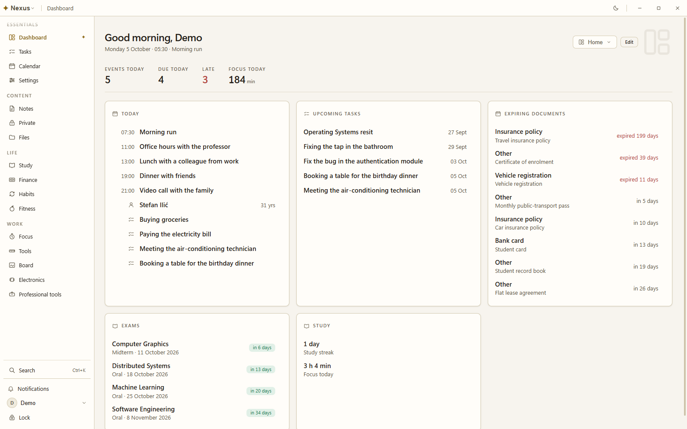
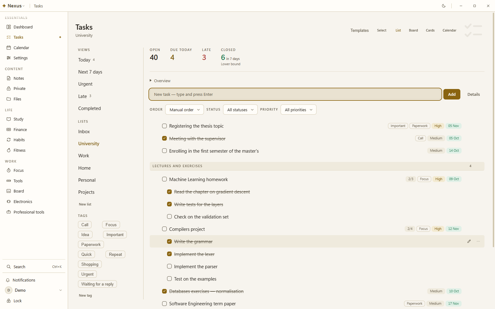
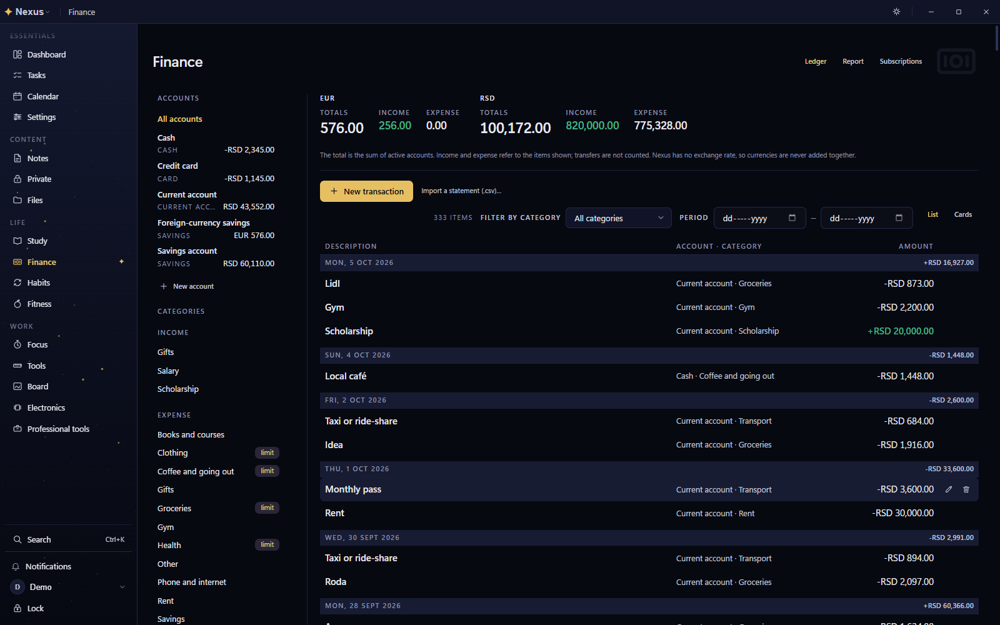
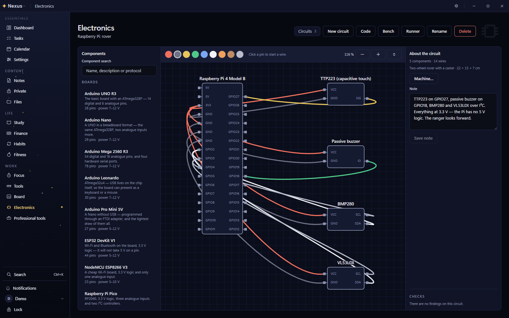

# Nexus

An offline-first life-management app for your own computer. Tasks, calendar,
notes, documents, studying, habits, a focus timer, fitness, finance, a canvas
and an electronics workbench — one workspace, stored in a single encrypted
database on your device, working with the network off.

**The interface is in Serbian only.** That is a product decision, not a missing
translation: the copy is centralised in one file, so an English locale is an
extraction rather than a rewrite, and it is welcome as a contribution. Code,
comments and documentation are in English.

The desktop application is complete and in daily use. **It has not been
released yet** — there is no published build, no tag and no code signature, and
the first public release is being prepared now. The web app and its optional
end-to-end-encrypted sync are built out of this same codebase and are paused
until the desktop is finished; what exists for them stays built, tested and off
by default.

<p>
  
  
  
  
</p>

The screenshots are the demo profile rendered by the screenshot harness
(`pnpm --filter @nexus/desktop shots`), which drives the real application
through every screen and audits the result.

## Download

[**Releases**](https://github.com/lukastojiljkovic/Nexus/releases/latest) —
Windows installer, Linux AppImage and Linux tarball.

**Nothing is downloadable yet.** The first public release is pending: it waits
on this repository's open-source preparation and on Windows code signing, and
the project's own rule is that no public download happens before signing is
settled. Until then, build from source — see below.

## Requirements

| | |
| --- | --- |
| Windows | 10 or 11, x64 |
| Linux | x64 with glibc, a desktop with a working Secret Service keyring (gnome-keyring, KWallet, KeePassXC). Without one the app refuses to create an account rather than weaken the key chain |
| macOS | Not built. Nothing here has produced or opened a macOS artefact |

## Privacy and security, briefly

- **Local by default.** Your data is one encrypted SQLite database on your own
  device. The local path cannot reach the network, and that is enforced in CI
  rather than promised in copy.
- **No telemetry, no analytics, no crash reporting.**
- **Cloud is off by default**, and in the build this repository produces it
  cannot be turned on at all: no backend project is compiled in. Optional sync
  is end-to-end encrypted, and the server holds ciphertext only.

Read [PRIVACY.md](PRIVACY.md) for exactly what is stored where, and
[SECURITY.md](SECURITY.md) to report a vulnerability privately.
[TERMS.md](TERMS.md) covers the distributed binaries.

## Contributing

Contributions are welcome — see [CONTRIBUTING.md](CONTRIBUTING.md) for the build
commands, the rules the static gates enforce, and what has to pass before a pull
request. Participation is covered by
[CODE_OF_CONDUCT.md](CODE_OF_CONDUCT.md). Questions go to
[SUPPORT.md](SUPPORT.md).

## Licence

Apache License 2.0. See [`LICENSE`](LICENSE) and [`NOTICE`](NOTICE).

Third-party notices are generated from the shipped dependency tree, never
written by hand: they are shown inside the application under **Podešavanja →
Licence**, attached to each release as `THIRD-PARTY-NOTICES.md`, and regenerated
with `pnpm --filter @nexus/desktop licences`.

---

# For developers

## Build from source

Requirements: **Node >= 24** and **pnpm 11.10.0** (pinned through the root
`package.json`'s `packageManager` field, so `corepack enable` is enough).

```sh
pnpm install --frozen-lockfile
pnpm build
pnpm typecheck
pnpm lint
pnpm test
```

Then run the app, or check that it starts and works end to end:

```sh
pnpm --filter @nexus/desktop dev      # electron-vite dev server
pnpm --filter @nexus/desktop smoke    # build + launch + end-to-end check → "SMOKE OK"
pnpm --filter @nexus/desktop shots    # ~2,800 screenshots + a geometric audit
```

`pnpm install` provisions the Electron binary in a postinstall step. There is
no ABI dance to perform: since 13.0.3 the native SQLite module is a Node-API
addon, and one prebuilt file serves both Node (what the tests run on) and
Electron (what the app runs on). See **The native module** below.

## Everyday commands

Run from the repo root; each fans out over the workspace through Turborepo.

```sh
pnpm typecheck      # tsc --noEmit, strict, every package
pnpm test           # Vitest — core, db, desktop, and the script suites
pnpm lint           # ESLint, every package
pnpm build          # production build — tokens, desktop, gallery
```

The component gallery is the design-system review surface, not shipped to
users:

```sh
pnpm --filter @nexus/gallery dev
```

## The native module

`better-sqlite3-multiple-ciphers` is a native module, and since **13.0.3** it is
a Node-API one: the package ships eight prebuilt binaries keyed by platform and
arch with no ABI in the key, and its loader picks one at runtime. The same file
serves Node (what Vitest runs on) and Electron (what the app runs on), so there
is nothing to flip, nothing to restore, and `smoke`, `shots` and `demo` can run
while the tests do.

Nothing in this repo compiles it. `pnpm-workspace.yaml` denies the package a
build script for that reason — the `binding.gyp` it still ships would otherwise
make pnpm run `node-gyp rebuild` and fail the install on any machine without
Visual Studio's C++ workload, for a binary the package already carries.

## Building a release

`dist` builds for the **host platform only**. Not because of the native module
— that reason retired with 13.0.3, which carries every platform's binary — but
because an AppImage wants Linux tooling and an NSIS installer wants Windows',
and nothing here has ever produced or opened a cross-built artifact. `dist.mjs`
refuses a host it cannot package for before it builds anything.

A root [`Makefile`](Makefile) wraps this. It adds nothing the pnpm scripts do
not do; what it adds is **order** — `pnpm build` before `dist` is not optional
in a fresh tree, and skipping it fails inside Vite with „failed to resolve
entry for package" and no hint that a workspace package simply was not built
yet — and **refusal**, so the cross-build above is caught before the build
rather than after it.

```sh
make                 # the target list, and the host it detected
make linux           # AppImage + tar.gz   (refuses a non-Linux host)
make windows         # NSIS installer      (refuses a non-Windows host)
make verify          # typecheck, lint, test, build, and every static gate
make artifacts       # what is currently in apps/desktop/release/
```

`make linux` writes both Linux artifacts into `apps/desktop/release/`:

| | |
| --- | --- |
| `Nexus-<version>-x86_64.AppImage` | any glibc desktop, no packaging step |
| `nexus-<version>-linux-x64.tar.gz` | the payload the Gentoo ebuild installs |

**Building the Linux artifacts from a Windows machine: use WSL.** It is a real
Linux userspace, so what it produces are ordinary Linux artifacts — no Docker,
no VM. Run `make linux` from the WSL shell.

The Makefile needs GNU make and a POSIX shell, which on Windows means Git Bash
or WSL, not cmd.exe. Nothing depends on it: every target is one documented pnpm
script, and `pnpm --filter @nexus/desktop dist` remains the direct route.

Tagged releases are built by CI (`.github/workflows/release.yml`), which
produces the installers, a `SHA256SUMS` file, a CycloneDX SBOM, build-provenance
attestations and the rendered third-party notices, and uploads them to a
**draft** release for a human to publish.

The full Linux guide — the AppImage's sandbox and FUSE behaviour, the keyring
requirement, and installing the Gentoo overlay — is in
[apps/desktop/build/gentoo/README.md](apps/desktop/build/gentoo/README.md).

## Layout

```text
apps/
  desktop/     Electron shell — main, preload, renderer; the database lives here
  web/         The same renderer on a browser runtime
  gallery/     Component gallery (design review only)
packages/
  tokens/          Design tokens — the single source of truth for every style value
  core/            Platform-free domain: module registry, contracts, views engine
  db/              Encrypted SQLite, forward-only migrations, per-module stores
  ui/              Design-system components, token-only
  sync/            The sync engine — collection map, change journal, merge
  sync-crypto/     Key hierarchy, wrapping, pairing transcript
  sync-port/       The injected crypto seam, so no package hardcodes a primitive
  sync-transport/  The wire — PostgREST and Broadcast, no keys, no origin
```

| Package | What it may depend on |
| --- | --- |
| `tokens` | nothing |
| `core` | nothing platform-specific — no React, no DOM, no Node |
| `db` | Node + SQLite; imported only by the Electron **main** process |
| `ui` | React + `tokens` |
| `sync-port` | nothing — it is the interface the others are written against |
| `sync-crypto` | `sync-port` |
| `sync-transport` | an injected `HttpPort`; it holds no `fetch`, no `WebSocket`, no origin and no key |
| `sync` | `core`, `sync-crypto`, `sync-transport` |

Feature modules never import each other; they meet through the contracts in
`core` (widgets, settings, search, import/export, tools).

## Architecture in one screen

- **The renderer is untrusted.** `contextIsolation` and `sandbox` are on,
  `nodeIntegration` is off, and navigation and window-opening are locked down.
- **The database is main-process only.** The renderer reaches it exclusively
  through a typed IPC allowlist: channel constants are shared, every payload is
  validated field by field in main, and the preload bridge exposes one method per
  channel with no generic passthrough.
- **Every SQL value is bound**, never interpolated, and every store statement is
  scoped by `profile_id`.
- **Storage** is one SQLite database (SQLCipher-class encryption at rest),
  UUIDv7 keys, ISO-8601 timestamps, soft deletes for undo, and a single
  forward-only migration stream.

## Styling rules

Every colour, space, radius and type value comes from `packages/tokens` as a
`--nx-*` CSS variable. **Raw `#hex`, `rgb()`/`hsl()` and the newer CSS colour
functions (`oklch()`, `lab()`, `lch()`, `color()`) are forbidden anywhere
outside that package.** The rule is enforced by the toolchain, not memory:
`pnpm check:colours` walks every package's `src`, runs as its own CI step on
every push and pull request, and has its own Vitest suite
(`scripts/check-colours.mjs`, `scripts/check-colours.test.mjs`). ESLint echoes
the same rule for TS/TSX string and template literals so a violation is a red
squiggle in the editor too, but the script remains the authoritative gate — it
alone also covers CSS and HTML.

```sh
pnpm check:colours   # exits non-zero and prints file:line: <text> per violation
```

A genuinely justified exception is a same-line `// nx-colour-allow: <reason>`
comment (`/* … */` in CSS, `<!-- … -->` in HTML) — never a blanket ignore, and
every use is still printed.

Two themes ship: **Dan** (light) and **Noć** (dark).

The **type scale** is `11 / 13 / 15 / 18 / 24 / 32` in whole pixels, with a
leading scale (`tight / snug / normal / loose`) beside it and a tighter tracking
value for large type. `caption` and `label` deliberately share 11px: a label is
a caption in uppercase with 0.12em of tracking, separated by treatment rather
than by size. Nothing in the app sets a font size, a line height or a letter
spacing that is not one of those tokens.

**Selection is typographic.** „Which one of these is on" — view switchers,
filter chips, reminder ladders, the weekday picker, the canvas tools — is accent
text plus weight and nothing else: no fill, no border, no glow. One class
(`.nx-segmented__option`) owns it and keys off `aria-pressed`, so the state a
screen reader is told and the state an eye is shown cannot drift apart. A filled
button therefore goes on meaning „press this" everywhere in the product.

**Layers are named, never numbered.** Stacking order is a property of the whole
app, so no surface picks its own: every `z-index` is `auto` or one
`var(--nx-layer-*)`, from a scale that runs `under` · `ground` · `figure` ·
`raised` · `docked` · `drawer-scrim` · `drawer` · `panel` · `overlay` ·
`dialog` · `menu`. Two names may share a number — a pinned header and a figure
over its ground are both 1 — because a token names an INTENT, and moving one
intent must not silently drag the other with it. `pnpm check:layers` enforces
it in CSS and in inline styles set from TS, and also checks that the scale is
still strictly increasing: every call site would go on passing if a layer were
edited to sit under the one it is meant to cover.

## Testing

Vitest across the workspace. Data and store logic is written test-first. The
desktop `smoke` script is the end-to-end check: it builds the app, launches
Electron, exercises the real IPC surface against a real database, and prints
`SMOKE OK`.

Beyond the unit tests there are the **static gates** — `check:colours`,
`check:egress`, `check:runner` and the rest, listed in the root `package.json`
under `check:*` — each of which is a rule this project states somewhere in
prose, made executable. They need no build output and each runs as its own CI
step, so a red check names the rule that broke. `pnpm test` also runs a
wall-mutation suite that breaks the server SQL one line at a time and demands
the specific complaint.

Serbian text is sorted and compared with `Intl.Collator(["sr-Latn", "sr"])` —
plain `"sr"` mis-tailors the Latin diacritics (š, č, ć, ž, đ).

## CI

- **CI** (`.github/workflows/ci.yml`) — `verify`: every static gate, the build,
  typecheck, lint and the full test suite, on every push to `main` and every
  pull request. It never launches Electron, so the smoke check is a local gate.
- **Security** (`.github/workflows/security.yml`) — a whole-history gitleaks
  secret scan plus a dependency audit, on every push and on a schedule.
- **CodeQL**, **Dependency review** and **Scorecard** are wired up and
  deliberately inert while the repository is private: code scanning and
  dependency review need GitHub Advanced Security, and Scorecard reads public
  repositories. Each is gated on the repository being public, so all three
  switch themselves on with the visibility change.

## Language

All user-facing copy is Serbian and lives in `strings.sr.ts`, centralized so a
later i18n extraction is mechanical. Code, comments and documentation are in
English.
